# 🧠 Multi-Agent Assessment System

An advanced, production-grade multi-agent AI system powered by **Groq** (`llama-3.3-70b-versatile`). 
This repository implements two complex enterprise capabilities utilizing specialized, cooperating AI agents. Each agent acts on isolated data domains and passes structured JSON to a state-machine orchestrator.

---

## 🗺️ High-Level Architecture

The system embraces a **shared-tool, specialized-agent** architecture. The heavy lifting (statistical analysis, regex parsing, file operations) is done purely in python to keep token counts low and latency blazing fast, while the LLM acts as the orchestrating reasoning engine.

```mermaid
graph TD
    %% ─── USERS / CLI ───
    User(("🧑‍💻 User"))
    CLI["💻 main.py CLI\n(Task Runner)"]
    
    User -->|python main.py| CLI

    %% ─── SHARED INFRASTRUCTURE ───
    subgraph Core["⚙️ Shared Infrastructure Layer\n(shared/)"]
        LLM["🧠 LLM Inference Client\n(Llama-3-70b)"]
        TraceLogger["📝 Telemetry Logger\n(@trace_agent)"]
        Models["🛡️ TypedDict Models\n(Data Validation)"]
    end

    %% ─── TOOLS ───
    subgraph NativeTools["🛠️ Native Python Tools\n(tools/)"]
        MetricsTool["📈 Metrics Analysis\n(numpy, scipy)"]
        FeedbackTool["💬 Feedback Processing\n(TextBlob)"]
        LogTool["📜 Log Pattern extraction\n(Regex)"]
        ExecTool["⚡ Python Execution\n(Subprocess/Sandbox)"]
    end

    CLI -.-> Core
    Core -.-> NativeTools

    %% ─── ASSESSMENT 1: WAR ROOM ───
    subgraph A1["⚔️ Assessment 1: War Room Pipeline"]
        A1_Orch{"🔄 War Room\nOrchestrator"}
        
        A1_A1["Data Analyst Agent"]
        A1_A2["Marketing Agent"]
        A1_A3["Product Manager Agent"]
        A1_A4["Finance Agent"]
        A1_A5["Growth Agent"]
        A1_A6["Risk/Critic Agent"]

        A1_Orch -->|Stage 1| A1_A1
        A1_Orch -->|Stage 2| A1_A2
        A1_Orch -->|Stage 3| A1_A3
        A1_Orch -->|Stage 4| A1_A4
        A1_Orch -->|Stage 5| A1_A5
        A1_Orch -->|Stage 6| A1_A6
        
        %% Tool Connections
        A1_A1 -.-> MetricsTool
        A1_A4 -.-> MetricsTool
        A1_A5 -.-> MetricsTool
        A1_A6 -.-> MetricsTool
        A1_A2 -.-> FeedbackTool
    end

    %% ─── ASSESSMENT 2: BUG TRIAGE ───
    subgraph A2["🐛 Assessment 2: Bug Triage Pipeline"]
        A2_Orch{"🔄 Bug Triage\nOrchestrator"}
        
        A2_A1["Triage Agent"]
        A2_A2["Log Analyst Agent"]
        A2_A3["Reproduction Agent\n(Dynamic Code)"]
        A2_A4["Fix Planner Agent"]
        A2_A5["Critic Agent"]

        A2_Orch -->|Stage 1| A2_A1
        A2_Orch -->|Stage 2| A2_A2
        A2_Orch -->|Stage 3| A2_A3
        A2_Orch -->|Stage 4| A2_A4
        A2_Orch -->|Stage 5| A2_A5
        
        %% Tool connections
        A2_A2 -.-> LogTool
        A2_A3 -.-> ExecTool
    end

    CLI -->|--task a1| A1_Orch
    CLI -->|--task a2| A2_Orch
    
    A1_Orch -.-> LLM
    A2_Orch -.-> LLM

    %% ─── OUTPUTS ───
    subgraph Outputs["📁 System Outputs\n(outputs/)"]
        A1_Out["📄 a1_decision.json"]
        A2_Out["📄 a2_diagnosis.json"]
        Repro_Script["🐍 a2_repro_test.py"]
        TraceLog["📓 trace.log\n(Milliseconds precise)"]
    end

    A1_Orch ===>|Aggregates Decision| A1_Out
    A2_Orch ===>|Aggregates Diagnosis| A2_Out
    A2_A3 ===>|Writes & Executes| Repro_Script
    TraceLogger ===>|Appends| TraceLog

    classDef orch fill:#2b2d42,stroke:#8d99ae,stroke-width:2px,color:#fff;
    classDef agent fill:#8d99ae,stroke:#2b2d42,color:#fff;
    classDef output fill:#ef233c,stroke:#fff,stroke-width:2px,color:#fff;
    classDef tools fill:#118ab2,stroke:#073b4c,color:#fff;
    classDef core fill:#06d6a0,stroke:#073b4c,color:#000;

    class A1_Orch,A2_Orch orch;
    class A1_A1,A1_A2,A1_A3,A1_A4,A1_A5,A1_A6,A2_A1,A2_A2,A2_A3,A2_A4,A2_A5 agent;
    class A1_Out,A2_Out,Repro_Script,TraceLog output;
    class MetricsTool,FeedbackTool,LogTool,ExecTool tools;
    class LLM,TraceLogger,Models core;
```



---

## 🎯 Task 1: The "War Room" (Product Launch Decision)

A high-stakes product launch simulation taking place post-launch where user sentiment is clashing with error tracking. 
The Multi-Agent system acts as a virtual boardroom to decide if the launch should **Proceed**, **Pause**, or **Roll Back**.

### Agents Involved:
1. 📊 **Data Analyst:** Analyzes 14-day time-series metrics & triggers Z-score anomaly detection.
2. 🗣️ **Marketing:** Performs sentiment analysis on user feedback, extracts themes without ML models via TF-IDF, and drafts comms.
3. 💼 **Product Manager:** Weighs the analytical and marketing outputs against predefined SLAs, producing user impact summaries.
4. 💰 **Finance (Bonus):** Projects daily revenue at risk based on checkout dropoff and payment gateway failure metrics.
5. 📈 **Growth (Bonus):** Segregates funnel/retention metrics from pure error metrics to prevent over-reacting to transactional bugs.
6. ⚠️ **Risk Critic:** Adversarially challenges assumptions from the PM & Analyst, formulating a Risk Register.

**Orchestrator Output:** Aggregates a tallied vote, computes a weighted confidence score, and structures an Action Plan into `outputs/a1_decision.json`.

---

## 🐛 Task 2: The Bug Triage Bot

An automated pipeline aimed at solving a P0 software bug (checkout crashing for orders >$500). Instead of just analyzing logs, this team of agents actually **writes code to reproduce the bug**, runs it dynamically, and evaluates the stack trace.

### Agents Involved:
1. 🩺 **Triage Agent:** Parses the messy markdown bug report, pulling out typed symptoms, and asserting initial hypotheses.
2. 🕵️ **Log Analyst:** Greps raw `app_logs.txt`, strips noise, and matches stack traces to the Triage Agent's hypotheses.
3. ⚙️ **Reproduction Agent:** Writes a minimal reproducible Python test script (`outputs/a2_repro_test.py`), executes it in a subprocess, and reports if the exit code correlates to the bug.
4. 🔧 **Fix Planner:** Maps the successfully reproduced trace to a root cause and drafts a specific patch methodology.
5. 🛡️ **Critic Agent:** Reviews the patch plan specifically to surface edge cases or unsafe system assumptions.

**Orchestrator Output:** Assembles a fully structured diagnosis complete with root cause confidence, impact scope, and code references into `outputs/a2_diagnosis.json`.

---

## ⚙️ Environment & Setup

### Prerequisites
- Python 3.11+
- A [Groq API Key](https://console.groq.com)

### Installation

```bash
# 1. Clone the repository
git clone https://github.com/yonlysuraj/Multi-Agent-System.git
cd Multi-Agent-System

# 2. Create and activate a Virtual Environment
python -m venv venv
# On Windows:
.\venv\Scripts\Activate
# On Mac/Linux:
source venv/bin/activate

# 3. Install dependencies
pip install -r requirements.txt

# 4. Setup Environment Variables
cp .env.example .env
# Edit .env and insert your GROQ_API_KEY
```

---

## 🚀 Execution

Both assessments are executed via the `main.py` entrypoint. The terminal outputs rich formatting, progress spinners, and summarized vote tallies.

```bash
# Run Task 1 (War Room)
python main.py --task a1

# Run Task 2 (Bug Triage)
python main.py --task a2

# (Optional) Run both sequentially
python main.py --task both
```

> **Note:** To avoid rate-limits on Groq's free tier, it is recommended to run the assessments individually with a slight delay between them, rather than chained together.

---

## 📁 Traceability & Output Logs

Multi-step AI pipelines can feel like black boxes. To counter this, every single agent turn, LLM latency, token count, and pure-python tool execution is recorded.

All outputs are structured and saved in the `outputs/` directory:
- `a1_decision.json`: The War Room consensus, action plan, and vote tally.
- `a2_diagnosis.json`: The bug execution, root cause, and patch plan.
- `a2_repro_test.py`: Generated by the AI dynamically during Bug Triage to ensure the bug is real.
- `trace.log`: A comprehensive, millisecond-accurate event journal detailing everything the multi-agent system does under the hood.

### Reading `outputs/trace.log`

Every line in `trace.log` follows this fixed format:

```
[TIMESTAMP] [TASK] [STAGE/COMPONENT] [EVENT_TYPE] message
```

| Field | Values | Meaning |
|-------|--------|---------|
| `TIMESTAMP` | `2026-04-07 20:25:20` | Wall-clock time of the event |
| `TASK` | `A1` or `A2` | Which assessment is running |
| `STAGE/COMPONENT` | `STAGE 0`, `DataAnalyst`, `LLM`, `TOOL` | Which part of the pipeline emitted the log |
| `EVENT_TYPE` | `START`, `END`, `INFO`, `ERROR` | Lifecycle marker (only on agent lines) |

**Three core event patterns to look for:**

```
# 1. Agent lifecycle — shows how long each agent took
[2026-04-07 20:25:20] [A1] [STAGE 1] [DataAnalyst] START
[2026-04-07 20:25:22] [A1] [STAGE 1] [DataAnalyst] END — took 2.6s

# 2. Tool calls — deterministic Python functions called by agents
[2026-04-07 20:25:20] [A1] [TOOL]    analyze_metrics() called — 8 metrics, launch_day=7
[2026-04-07 20:25:20] [A1] [TOOL]    analyze_metrics() → analyzed 8 metrics

# 3. LLM calls — shows token usage and latency per inference
[2026-04-07 20:25:22] [A1] [LLM]     groq.chat() called — model=llama-3.3-70b-versatile, tokens_in=1070
[2026-04-07 20:25:22] [A1] [LLM]     groq.chat() → tokens_out=405, latency=1.6s
```

**To trace a specific agent's full execution**, search for its name:
```bash
grep "DataAnalyst" outputs/trace.log
grep "ReproductionAgent" outputs/trace.log
```

**To see only LLM calls** (token usage across the run):
```bash
grep "\[LLM\]" outputs/trace.log
```

**To see only tool invocations:**
```bash
grep "\[TOOL\]" outputs/trace.log
```

> The log is append-only. Each run appends a new block. Assessment 1 entries are tagged `[A1]`; Assessment 2 entries are tagged `[A2]`.
